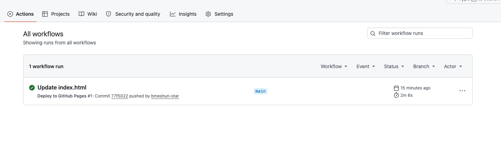
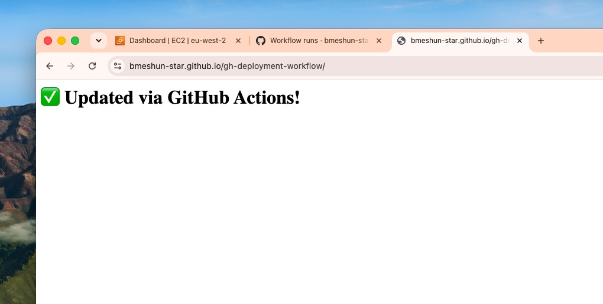

# 🚀 GitHub Actions → GitHub Pages Deployment
Automated CI/CD pipeline that deploys your static website **only when `index.html` changes**.

---

## 🎯 Project Goal
Learn continuous integration and deployment by building a workflow that automatically updates your live site via GitHub Actions.

---

## 📋 Requirements Met
✅ Workflow triggers **only on push to `main` and only if `index.html` is modified**
✅ Deploys automatically to GitHub Pages
✅ Live site available at `https://bmeshun-star.github.io/gh-deployment-workflow/`

---

## 📸 Screenshots

### 1. Workflow Running Successfully

*Shows the deployment workflow triggered automatically after changing `index.html` - confirms CI/CD is working.*

### 2. Live Deployed Website

*The live page served directly from GitHub Pages, updated automatically by the workflow.*

---

## 🛠️ How It Works
1. Created `index.html` with your custom content
2. Added `.github/workflows/deploy.yml` with the `paths: ['index.html']` filter
3. Enabled **GitHub Pages → Source: GitHub Actions** in repo settings
4. Any change to `index.html` pushed to `main` runs the workflow and updates the live site

---

**Live Site:** https://bmeshun-star.github.io/gh-deployment-workflow/
